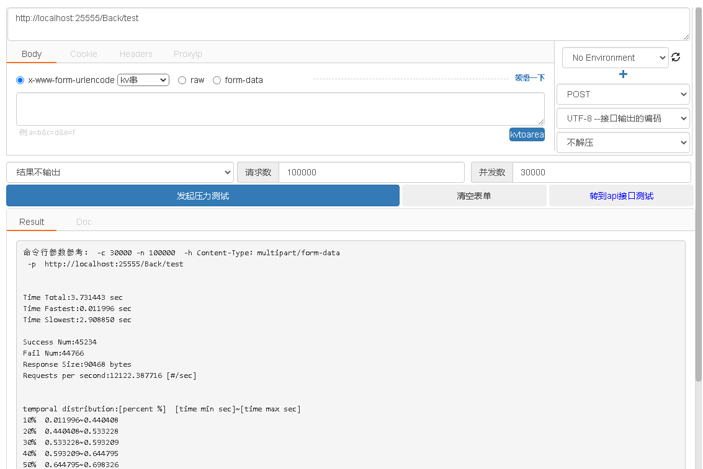
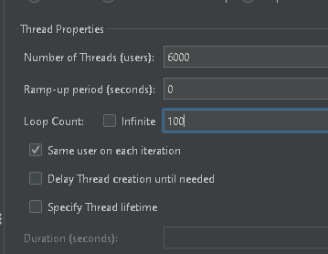
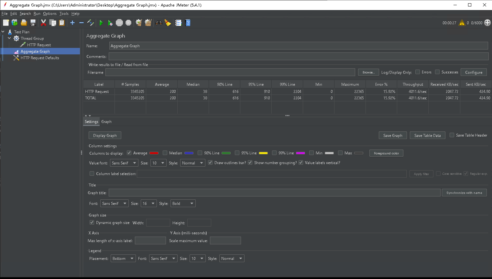
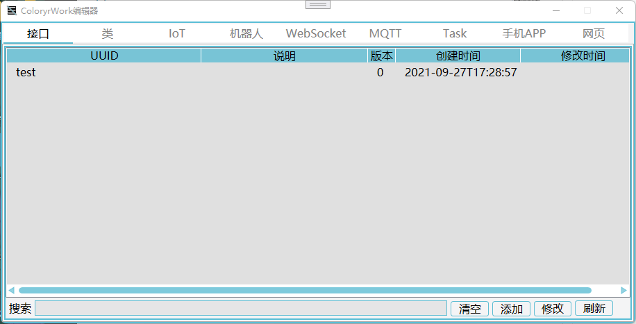
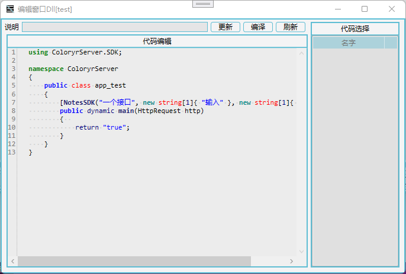

# [ColoryrWork](https://github.com/Coloryr/ColoryrWork)
  
一个多功能服务器/应用框架  

ColoryrServer  
在线.动态编译.可编程.多功能.服务器框架

这是一个中型服务器，在单进程下可以有1.5W并发量（理论性能）  
~~可以打开多管线，但是没测试过~~

理论性能测试  
- 测试机器：  

测试环境：  
- 系统：Windows Server 2019
- Net5：5.0.401
- JAVA：JAVA14  
简单的一个测试接口  

在postjson的压力测试下的性能  

在JMeter的压力测试下的性能  

- 可以对接Mysql\Redis\MsSql\Oracle数据库
- 可以对接[ColorMirai](https://github.com/Coloryr/ColorMirai) QQ机器人

ColoryrApp(在计划中)  
动态加载App

ColoryrBuild  
框架编辑器

