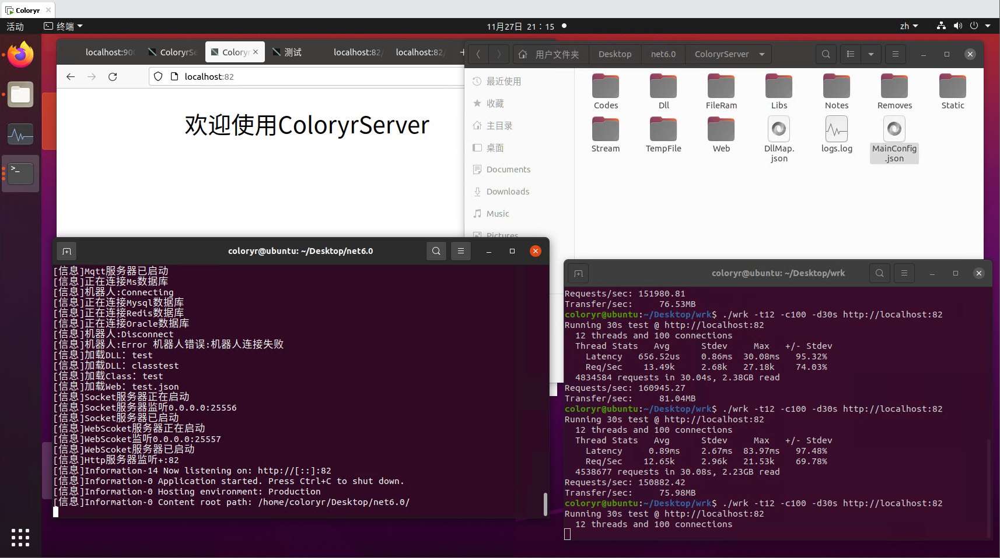
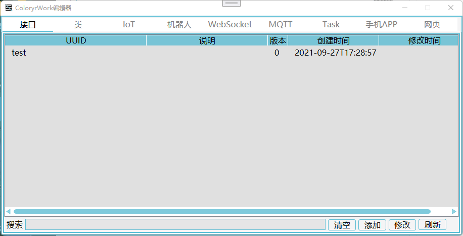

# [ColoryrWork](https://github.com/Coloryr/ColoryrWork)
  
一个多功能服务器/应用框架  

## ColoryrServer  
在线动态编译.多功能.服务器框架  
**服务器框架内不包含任何业务代码，需要用户自行编写**



- 这是一个中型服务器
- 支持Linux和Windows下运行
- 可以对接Mysql\Redis\MsSql\Oracle数据库
- 自带Http\WebSocket\Socket\Mqtt支持
- 可以添加ssl证书(ASP模式)
- 可以对接[ColorMirai](https://github.com/Coloryr/ColorMirai) QQ机器人
- 占用内存极少
- 可以配置端口反向代理和域名反向代理
- 业务代码修改无需重启
- 可以自己添加DLL库，并在端口文件中调用

[理论性能测试](./doc/test.md)

[部署&启动](./doc/run.md)

[目录文件说明](./doc/dir.md)

[配置文件说明](./doc/config.md)

[业务代码编写](./doc/code.md)
```
注：net5分支在生产环境测试过，net6没有在生产环境测试
```

## ColoryrApp(在计划中)  
动态加载App

## ColoryrBuild  
框架编辑器

[编辑器使用说明](./doc/builder.md)



