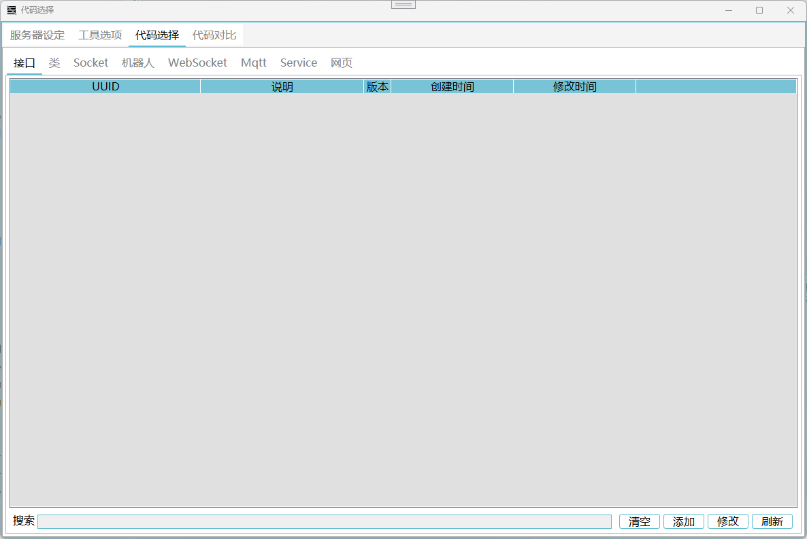

# [ColoryrWork](https://github.com/Coloryr/ColoryrWork) 
  

一个应用型服务框架

[更新日志](./doc/update.md)

## ColoryrServer  
在线动态编译.多功能.应用服务器框架  
**服务器框架内不包含任何业务代码，需要用户自行编写**

- 这是一个中型服务器框架
- 支持`Linux`下运行
- 可以对接`Mysql\Redis\MsSql\Oracle\Sqlite`数据库
- 自带`Http\WebSocket\Socket\Mqtt\Netty`支持
- 可以添加`Ssl证书`
- 可以对接[ColorMirai](https://github.com/Coloryr/ColorMirai)QQ机器人
- 可以配置端口反向代理和域名反向代理
- 业务代码修改无需重启
- 可以自己添加DLL库，并在代码文件中调用
- 自带`Vue项目`编译与上线

[理论性能测试](./doc/test.md)

[部署&启动](./doc/run.md)

[目录结构与文件信息](./doc/config.md)

[业务代码编写](./doc/code.md)

## ColoryrApp(在计划中)  
动态加载App

## ColoryrBuild  
框架编辑器

[编辑器使用说明](./doc/builder.md)

