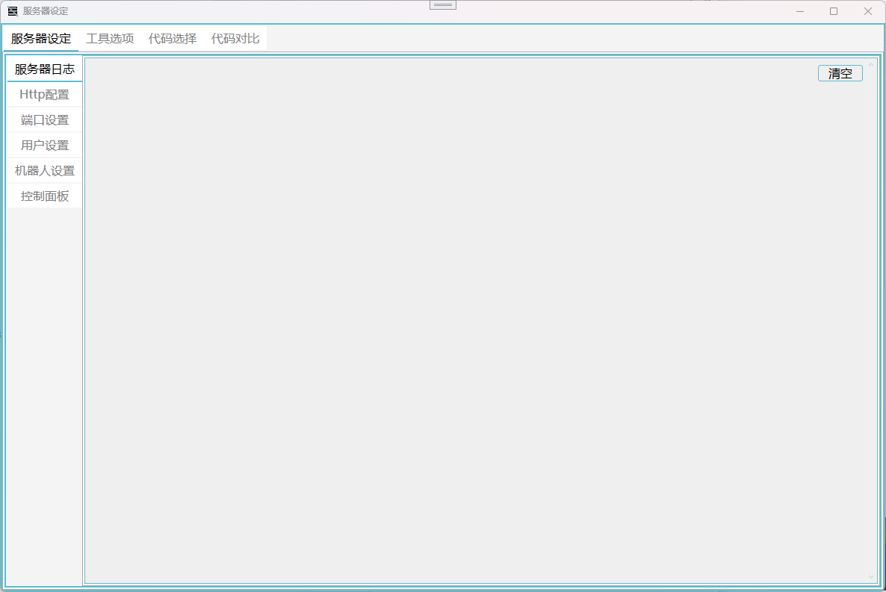
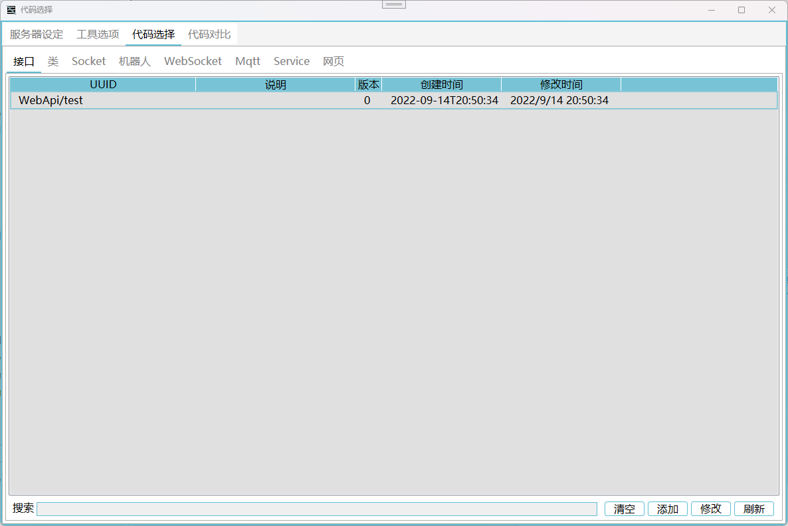
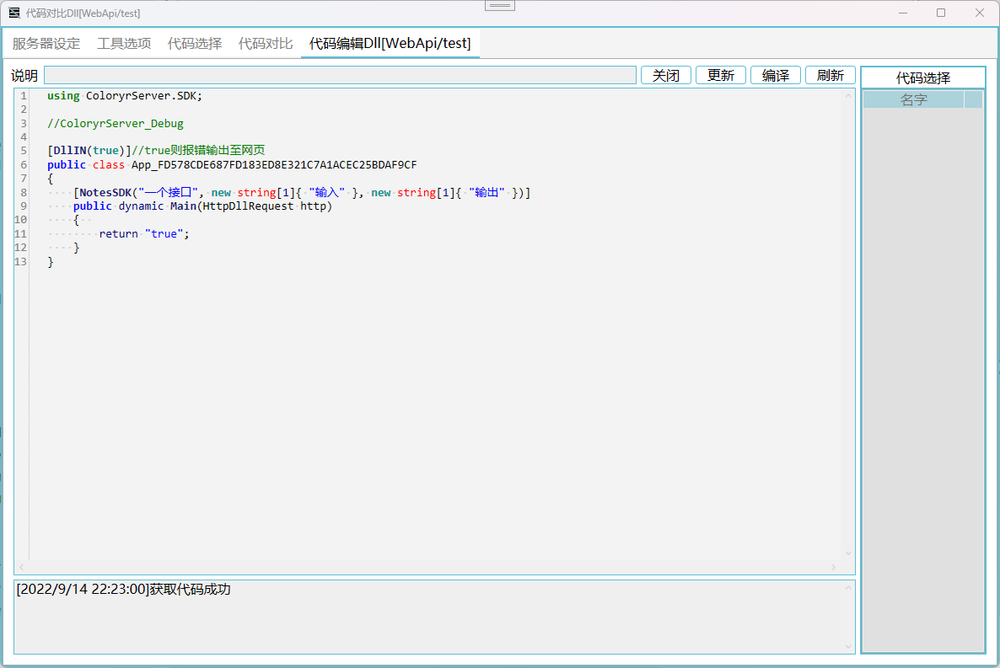

# ColoryrBuild

编辑器使用说明

[返回](../README.md)

打开编辑器，连接服务器后得到下面的窗口，在这里可以进行服务器业务代码的编写

在编辑器选择接口选项卡，右键添加一个接口  
内容是软路由地址

右键接口编辑即可修改代码

其他类型基本都相同  
`网页`和`class`类型在修改代码后需要点击更新才能保存代码更改

如果你不想用自带的代码编辑器，可以用其他编辑器打开`CodeTemp`文件夹