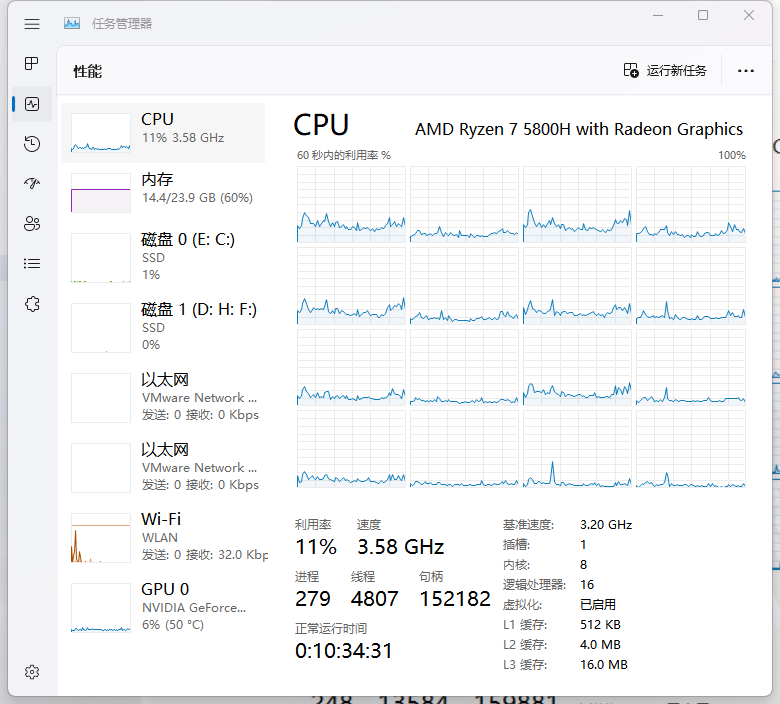
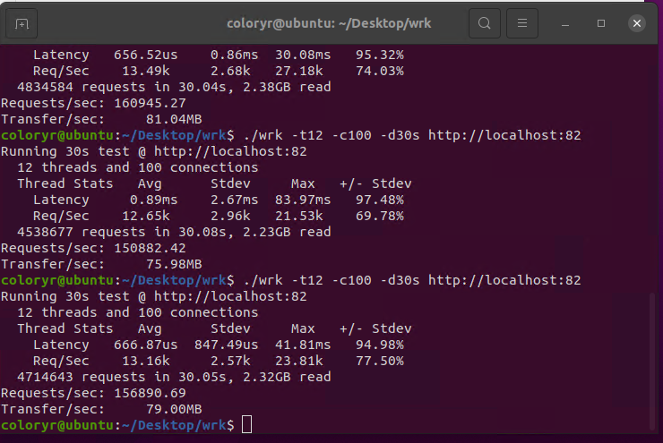
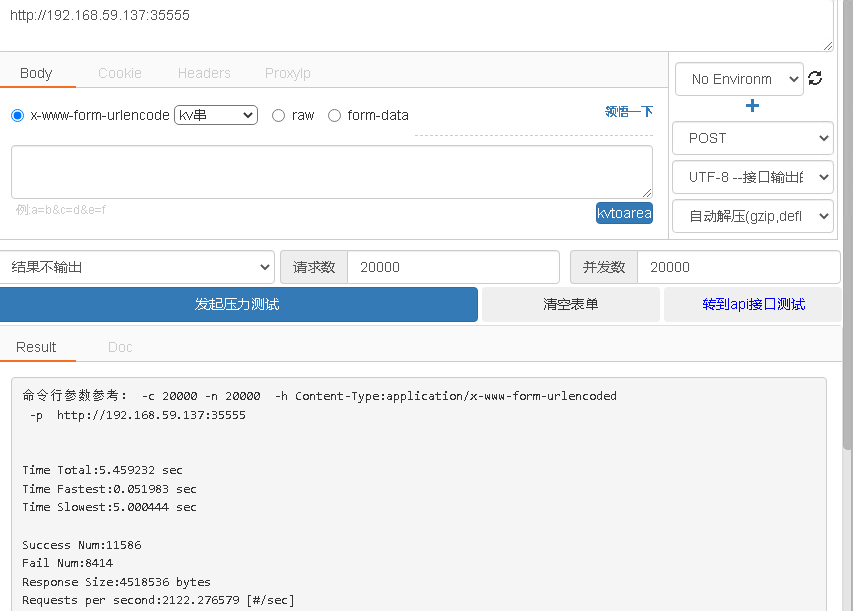
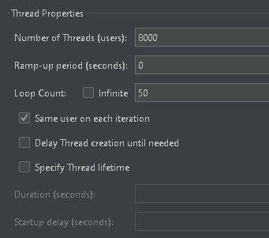
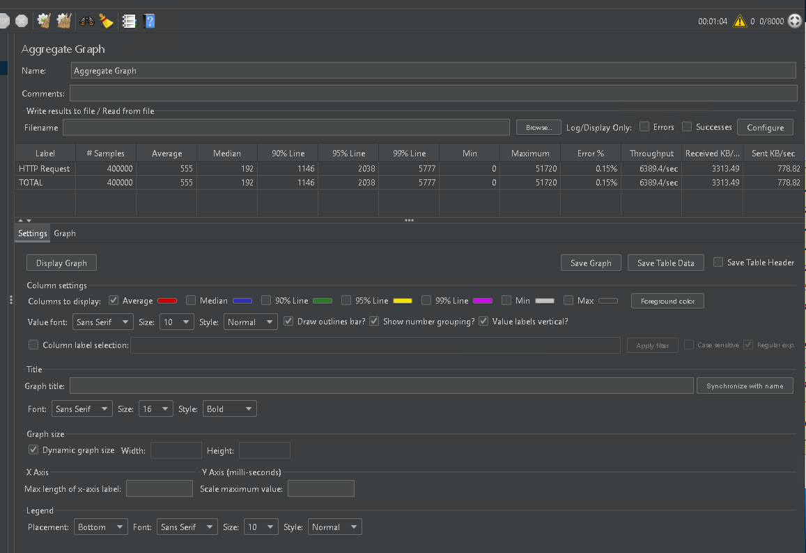
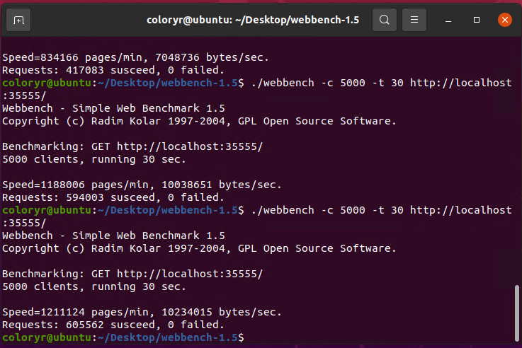
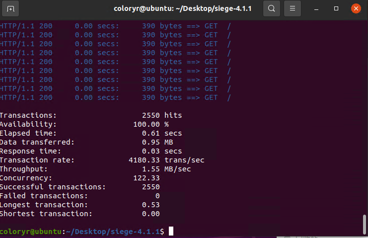

# ColoyrServer

## 理论性能测试
[返回](../README.md)
### 测试机器：  
  
### 测试环境：  
- 系统：Ubuntu20(虚拟机，8G内存 4核心 8线程)  
  （宿主系统：Windows Server 2019）
- .Net版本：6.0.100-rc.1
-------------------
## [wrk](https://github.com/wg/wrk)
  
## [postjson](http://coolaf.com/)  
  
## [JMeter](https://jmeter.apache.org/)
  
  
## [webbench](https://github.com/EZLippi/WebBench)
  
## [siege](https://github.com/JoeDog/siege)
```
siege -c 255 -r 10 http://localhost:35555/
```
  