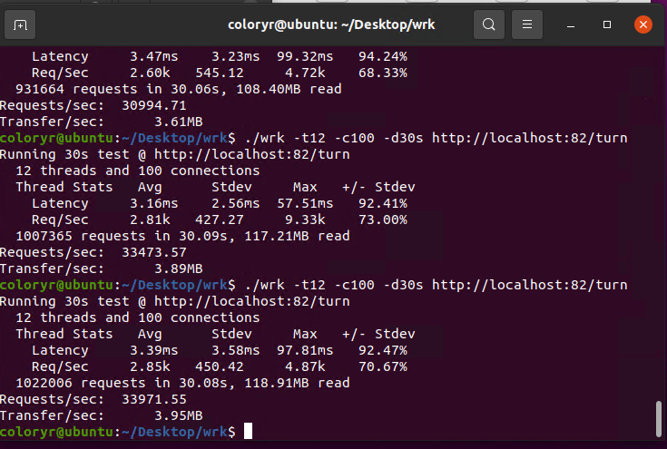
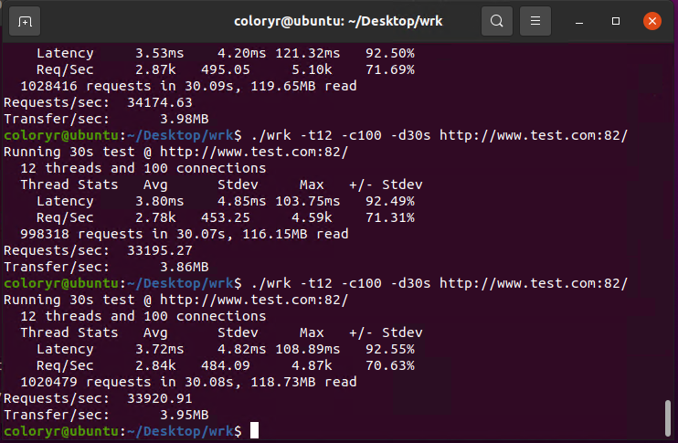
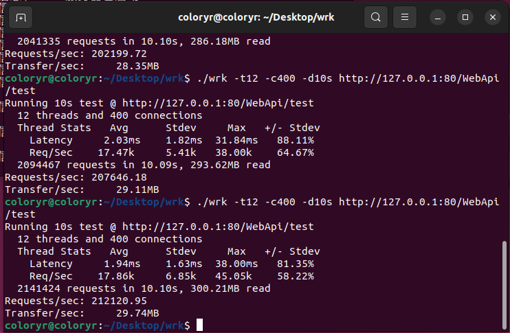
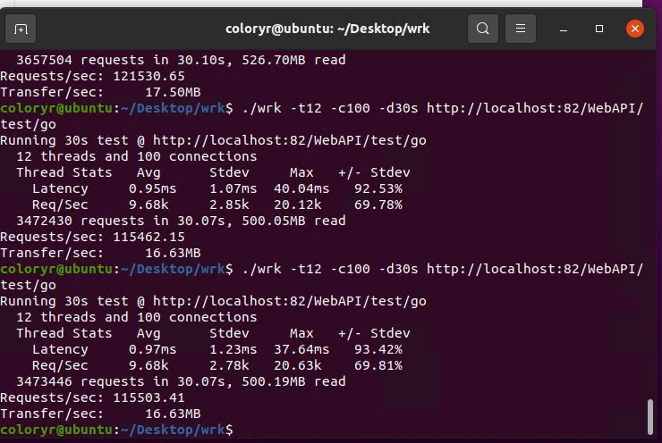
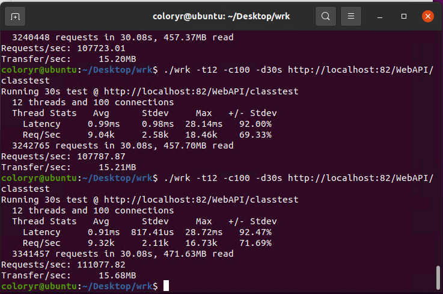
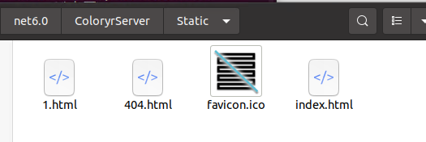
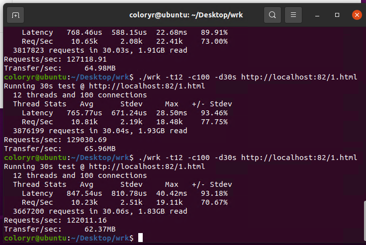
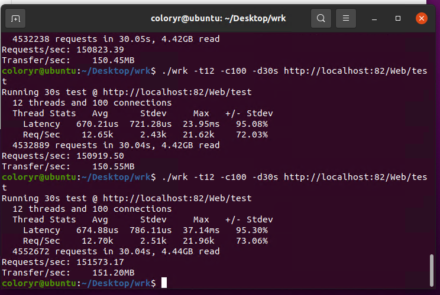

# ColoryrServer

## 理论性能测试
[返回](../README.md)
### 测试机器：  
  
### 测试环境：  
- 系统：Ubuntu20(虚拟机，8G内存 4核心 8线程)  
  （宿主系统：Windows Server 2019）
- .Net版本：6.0.100
-------------------
### [wrk测试](https://github.com/wg/wrk)
   

## 反向代理测试

### 被反代部分
使用go编写一个简单的服务器
```go
package main
 
import (
    "fmt"
    "net/http"
)
 
func main() {
    http.HandleFunc("/", func(w http.ResponseWriter, r *http.Request) {
        fmt.Fprintf(w, "你好，你的请求是 %s\n", r.URL.Path)
    })
 
    http.ListenAndServe(":8000", nil)
}
```

简单测试  
  

-------------------
### 服务器配置文件
```
"Rotes": {
  "turn": {
    "Url": "http://127.0.0.1:8000/",
    "Heads": {}
  }
},	
"RoteEnable": true,
"Ssl": false,
"Ssls": {
  "default": {
    "SslLocal": "./test.sfx",
    "SslPassword": "123456"
  }
},
"UrlRotes": {
  "www.test.com": {
    "Url": "http://localhost:8000/",
    "Heads": {}
  }
},
"NoInput": false,
"Http": [
  {
    "IP": "+",
    "Port": 81
  }
],
```

`www.test.com`会指向`127.0.0.1`

### 端口转发测试

  

### 域名映射测试

  


## 接口理论性能测试

### 接口类1
```C#
using ColoryrServer.SDK;

public class app_test
{
    [NotesSDK("一个接口", new string[1]{ "输入" }, new string[1]{ "输出" })]
    public dynamic main(HttpRequest http)
    {  
        return "测试";
    }
    [NotesSDK("一个接口", new string[1]{ "输入" }, new string[1]{ "输出" })]
    public dynamic go(HttpRequest http)
    {  
        return "测试11";
    }
}
```
### 接口类2
```C#
using ColoryrServer.SDK;

[DLLIN(true)]
public class app_classtest
{
    [NotesSDK("一个接口", new string[1]{ "输入" }, new string[1]{ "输出" })]
    public dynamic main(HttpRequest http)
    {  
    var c = Tools.GetClass("test");
        return c.getString("1");
    }
}
```
### 库类
```C#
using ColoryrServer.SDK;

[DLLIN]
public class test
{
    public test()
    {
             
    }

    public string getString(string data)
    {
        return data + "test";
    }
}
```

### wrk测试
  
  
  

## 前端网页测试

### 静态网页
  

### 动态编译网页
  

### wrk测试
  
  