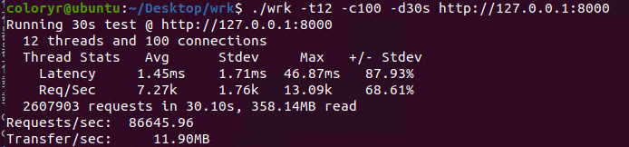
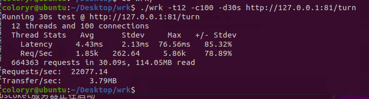
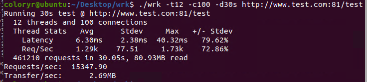

# ColoryrServer

## 理论性能测试
[返回](../README.md)
### 测试机器：  
  
### 测试环境：  
- 系统：Ubuntu20(虚拟机，8G内存 4核心 8线程)  
  （宿主系统：Windows Server 2019）
- .Net版本：6.0.100-rc.1
-------------------
### [wrk](https://github.com/wg/wrk)
  
### [postjson](http://coolaf.com/)  
  
### [JMeter](https://jmeter.apache.org/)
  
  
### [webbench](https://github.com/EZLippi/WebBench)
  
### [siege](https://github.com/JoeDog/siege)
```
siege -c 255 -r 10 http://localhost:35555/
```
  

## 反向代理测试

### 被反代部分
使用go编写一个简单的服务器
```go
package main
 
import (
    "fmt"
    "net/http"
)
 
func main() {
    http.HandleFunc("/", func(w http.ResponseWriter, r *http.Request) {
        fmt.Fprintf(w, "你好，你的请求是 %s\n", r.URL.Path)
    })
 
    http.ListenAndServe(":8000", nil)
}
```

简单测试  
  

-------------------
### 服务器配置文件
```
"Rotes": {
  "turn": {
    "Url": "http://127.0.0.1:8000/",
    "Heads": {}
  }
},	
"RoteEnable": true,
"Ssl": false,
"Ssls": {
  "default": {
    "SslLocal": "./test.sfx",
    "SslPassword": "123456"
  }
},
"UrlRotes": {
  "www.test.com": {
    "Url": "http://localhost:8000/",
    "Heads": {}
  }
},
"NoInput": false,
"Http": [
  {
    "IP": "+",
    "Port": 81
  }
],
```

`www.test.com`会指向`127.0.0.1`

### 端口转发测试

  

### 域名映射测试

  
