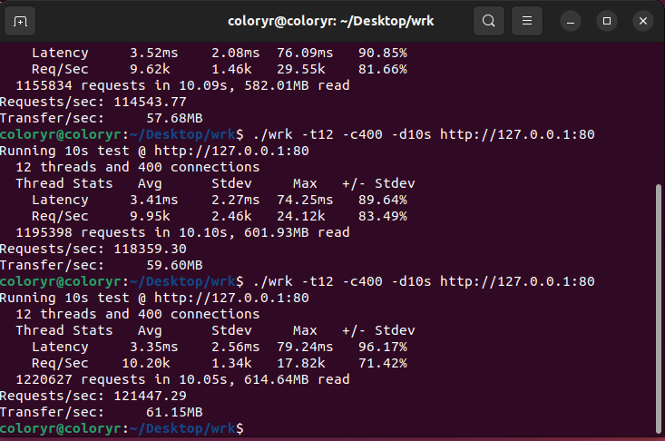

# ColoryrServer

理论性能测试

[返回](../README.md)

### 测试机器：  
  
### 测试环境：  
- 系统：Ubuntu22.04(虚拟机，8G内存 8核心 8线程)  
  （宿主系统：Windows 11）
- .Net版本：6.0.400
-------------------
### [wrk测试](https://github.com/wg/wrk)
   

## 接口理论性能测试

### 接口类1
```C#
using ColoryrServer.SDK;

public class app_test
{
    [NotesSDK("一个接口", new string[1]{ "输入" }, new string[1]{ "输出" })]
    public dynamic main(HttpRequest http)
    {  
        return "true";
    }
}
```

### wrk测试
  
